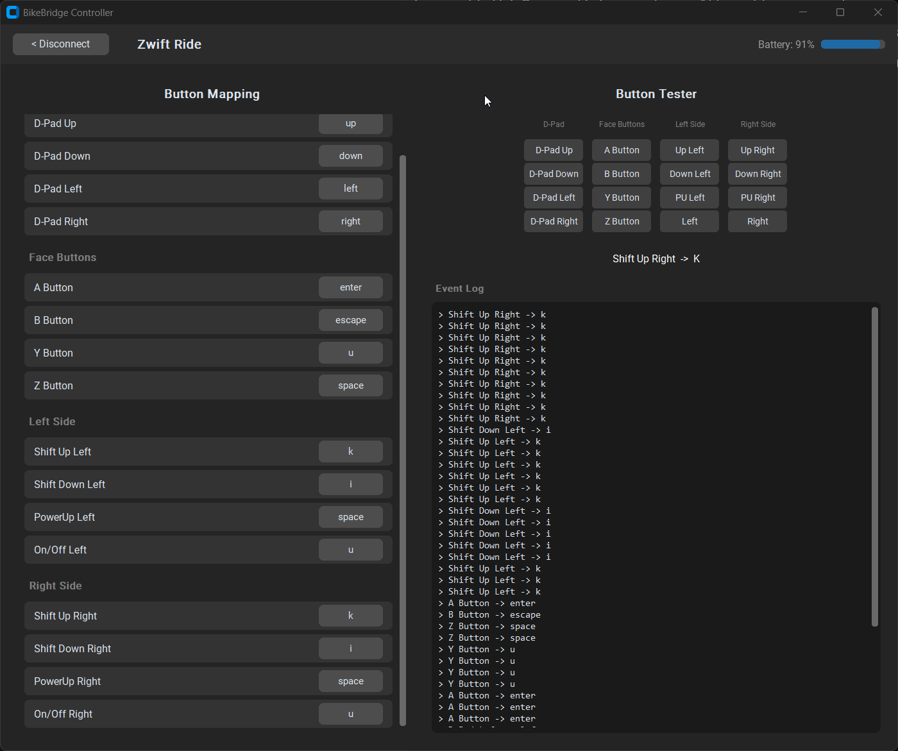

# BikeBridge — Universal BLE Controller Key Mapper

Use your **Zwift Ride**, **Zwift Click v2**, or other BLE cycling controllers as a universal keyboard macro pad on Windows. Map any button to any key for virtual shifting in **MyWhoosh**, **Zwift**, **Rouvy**, or any other trainer app.



## Features

* **Auto-Discovery:** Scans for and connects to supported BLE controllers automatically
* **Multi-Radio Support:** Zwift Ride's left + right BLE radios are detected and connected as one device
* **Visual Button Tester:** See which buttons are pressed in real time with visual feedback
* **Custom Key Mapping:** Remap any button to any key — changes saved automatically
* **Battery Monitoring:** Live battery level display for supported devices
* **Dark Theme GUI:** Clean, modern desktop interface

## Supported Devices

| Device | Buttons | Battery |
|---|---|---|
| Zwift Ride | 16 (shift levers, d-pad, A/B/Y/Z, powerup, on/off) | Yes |
| Zwift Click v2 | 6 (plus, minus, directional) | No |

More devices can be added by extending `BaseDevice` in the `bikebridge` library.

## Quick Start

### 1. Install dependencies

```bash
pip install bleak pyautogui customtkinter
```

### 2. Run the GUI

```bash
python gui.py
```

### 3. Connect and play

1. Put your controller in pairing mode (blue blinking light)
2. Click **Connect Device**
3. Remap buttons if needed (click any key in the mapping list)
4. Open your trainer app and ride!

## CLI Usage

If you prefer no GUI, you can use the demo script or the standalone scripts:

```bash
# Auto-detect and connect with CLI output
python demo.py

# Scan only — list all BLE devices
python demo.py --scan-only

# Standalone scripts (original)
python zwift_ride.py     # Zwift Ride only
python start.py          # Zwift Click v2 only
```

## Project Structure

```
bikebridge/              # Core library
  scanner.py             # BLE device scanning
  mapper.py              # Key mapping with JSON persistence
  controller.py          # Device events -> keystrokes
  devices/
    base.py              # BaseDevice ABC — extend to add controllers
    registry.py          # Auto-matches BLE names to drivers
    zwift_ride.py        # Zwift Ride driver (16 buttons)
    zwift_click_v2.py    # Zwift Click v2 driver (6 buttons)
gui.py                   # Desktop GUI (CustomTkinter)
demo.py                  # CLI demo
```

## Adding a New Device

1. Create a new file in `bikebridge/devices/`
2. Extend `BaseDevice` and implement `matches()`, `default_button_map()`, `_handshake()`, `_handle_notification()`, `_get_characteristics()`
3. Register it in `bikebridge/devices/registry.py`

## License

MIT
